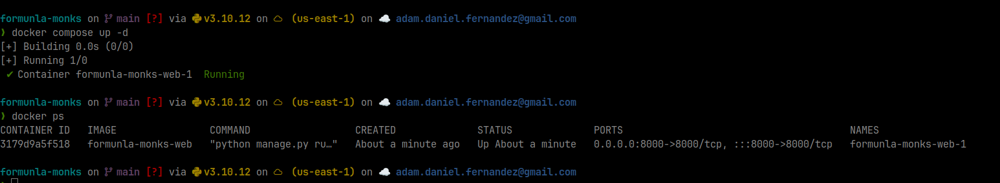
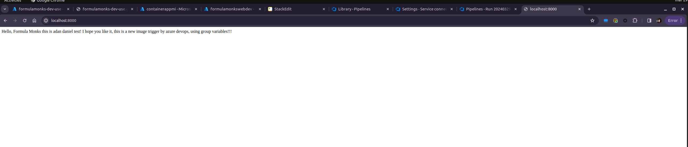
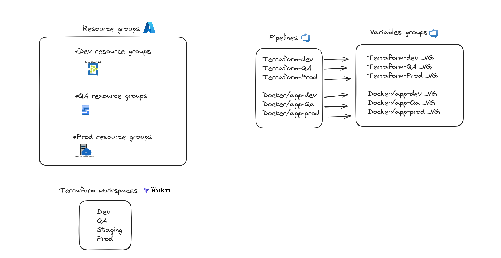
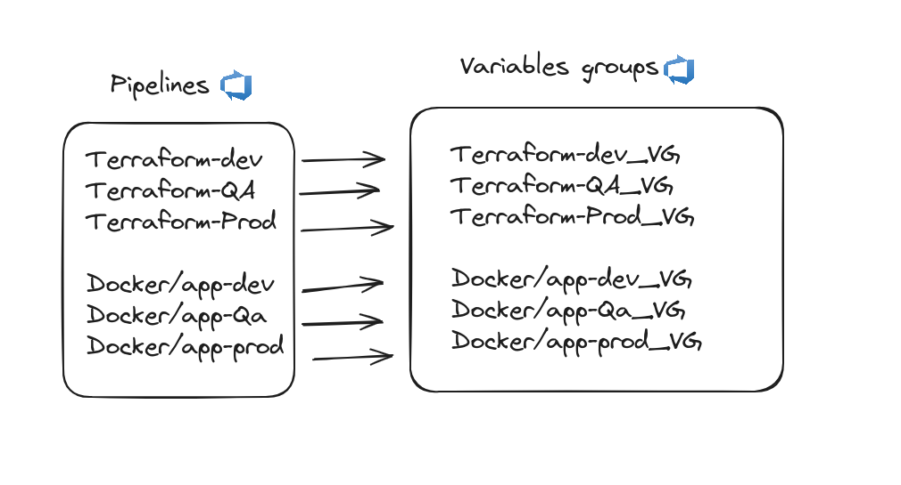

## Azure project documentation
Hello Formula Monks, here I leave the requested documentation about my Azure test where I used the mentioned technologies (terraform, azure devops, azure cli, git, github, etc.) I hope you like it


#### How to run the project locally using docker?

To run the local project with docker it is very simple, the first thing is that we have to have docker installed and also docker compose.
In case you dont have docker installed please go to this link: https://docs.docker.com/engine/install/
Once docker is installed please  got to the project folder execute the following command:
```
docker compose up -d
docker ps 
```
after you run it go to **localhost:8000** or **127.0.0.1:8000** and you should see the app up and running.





--- 
#### What was the major issue that you had and how did you solve it?

One of the challenges is that container app is relatively new with terraform so it was giving me some false positives, say terraform had finished creating the resource and it was not yet in azure or the resource was exploding because the user_assigned "was not ready" because apparently the Azure API takes a moment to actually show the resources but Terraform already said it was finished.

I solved it using `"depends_on"` and the `"time_sleep"` resource to delay the creation a little and thus be 100% sure.
there was other little issues like new accounts you have to enable some apis I solved using **azure-cli** 

---

#### how do you envision all the environments?

According to my experience with this project, visualize all the environments with the following architecture:

* Each environment must have its own resource group so there is less probability of failure when touching a resource or modifying it, since if all the environments lived in a single resource group that would give rise to an SPF (single point of failure) and multiple environments could be affected. environments at the same time

* Following that same line, I think the same for deployments, it is advisable to have 1 pipeline per environment so we can group each environment with its corresponding variables.

* Said previously, since each environment will have its own resource group, it must also have its own images, registry, and containers

Note: the terraform that I prepared is designed to be multienvironment since I use terraform workspaces to manage the environments, this results in having each statefile per environment, and I use the name of the workspace as the environment



---

#### What alternative you propose for env variables management?

As I had mentioned in the previous point, I think that the groups variables, which can be configured in Azure Devops, are a great resource for managing environment variables. Having one group variable per environment determines that this pipeline will always run with its corresponding variables. This can happen both for the infrastructure and for the application, if you can see I used them in my pipelines and it worked perfectly

And of course use **secrets** for more sensitive data



---

#### How would you improve availability in a production environment?

The first thing that comes to mind is to use multi-region replication for everything possible, as well as for image and container registries, use more intense code scanning and make unit tests mandatory.

---

#### What is your recommendation for future work?

My recommendation for future work would be to integrate azure devops with terraform directly and create the pipelines directly with terraform such as service connections, this part is a little complicated but it would make the solution more robust and we would have an entire ecosystem under infrastructure such as code + git
